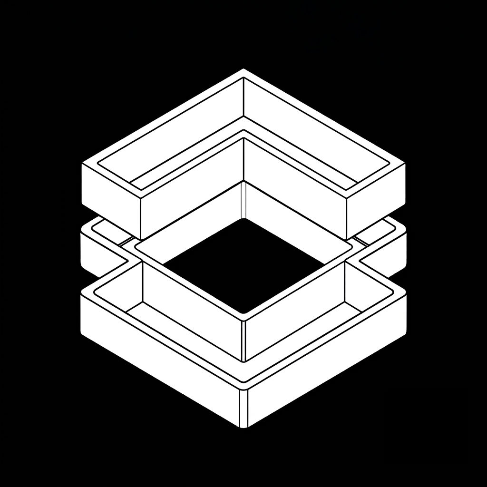

<div align="center">



# AI-Ready

**Deterministic knowledge observability and continuous improvement for AI-ready knowledge bases.**

[](https://www.python.org/downloads/)
[](https://www.apache.org/licenses/LICENSE-2.0)
[](https://github.com/astral-sh/ruff)
[](https://github.com/DAGWorks-Inc/burr)

</div>

---

Every team using AI coding assistants — Claude Code, Cursor, Copilot — depends on documentation quality. But documentation degrades over time as broken links accumulate, content goes stale, headings become ambiguous, and context goes missing. These issues silently degrade retrieval quality, and no one notices until the AI gives the wrong answer.

**AI-Ready** is a deterministic knowledge observability platform that evaluates knowledge *before* it reaches an AI system. Rather than measuring language models or retrieval algorithms, it measures the quality of the knowledge itself by treating knowledge as infrastructure that deserves the same observability as code.

## Quick Start

```bash
pip install -e .

# Scan a knowledge base
ai-ready scan ./docs

# View assessment report (dimensions, scores, signals)
ai-ready status

# Compare against a previous assessment
ai-ready diff

# Track health trend over time
ai-ready trend

# List signals with lifecycle information
ai-ready signals
```

## How It Works

```
Knowledge Sources (.md, .mdx, .txt, .rst, S3)
    │
    ▼
Signal Collection (10 deterministic collectors, 6 dimensions)
    │
    ▼
Problem Discovery (cluster signals → root causes)
    │
    ▼
Assessment (scored, versioned, stored in CockroachDB)
    │
    ▼
LLM Proposal Generation (with memory from CockroachDB)
    │
    ▼
Human Approval → Execution → Verification → Rollback on Regression → Learning
```

Assessment is **always deterministic**, no LLM required. Ten signal collectors across six dimensions (retrieval, context, consistency, trust, connectivity, workflow) scan the knowledge base and produce reproducible results regardless of which language model is available. The LLM only participates in the improvement loop, where it proposes fixes learnt by the agent's past outcomes. If verification detects regression, the system rolls back modifications.

## Signal Collectors

| Dimension | Collector | What It Detects |
|-----------|----------|----------------|
| Retrieval | Topic Purity | Documents covering too many unrelated topics |
| Retrieval | Context Independence | Content requiring external context to understand |
| Context | Heading Quality | Generic, numbered-only, placeholder, or too-short headings |
| Consistency | Terminology Consistency | Inconsistent terms across documents |
| Consistency | Contradiction Detection | Conflicting factual claims between documents |
| Trust | Canonical Source | Missing canonical versions of duplicated content |
| Trust | Freshness | Stale or outdated content |
| Connectivity | Link Integrity | Broken internal links |
| Connectivity | Knowledge Connectivity | Orphaned documents with no inbound links |
| Workflow | Workflow Completeness | Missing steps in documented workflows |

## Improvement Workflow

An Apache Burr state machine orchestrates the closed-loop proposal:

```
analyze_issue → generate_proposal → review_approval → execute_change → verify_improvement
```

The agent doesn't just fix problems, it remembers which fixes worked and which didn't, creating a learning loop that improves over time.

- **Signal-delta gate** — skips LLM analysis when nothing changed since the last assessment, saving tokens on steady-state repos.
- **Heuristic pre-analysis** — deterministic problem discovery without LLM, reducing token consumption on free-tier providers.
- **Edit budget** — rejects proposals that modify more than 20% of any artifact, preventing destructive rewrites.
- **Rejected-fix memory** — feeds previously failed edits into the next proposal round so the agent doesn't repeat mistakes.
- **Forking** — failed workflows can fork and retry with prior failure context, enabling intelligent recovery.
- **EMA strategy scoring** — tracks which remediation strategies worked (Exponential Moving Average), so successful strategies are reinforced and failed ones suppressed.
- **CockroachDB persistence** — workflow state is snapshotted at each transition and survives restarts. Resumable via `ImprovementManager.resume_workflow()`.

## Cloud Architecture

The system deploys as a serverless agent on AWS with CockroachDB Cloud as its persistent memory layer:

```
                    ┌─────────────────────────────────────────────────┐
                    │              AWS (Serverless)                    │
                    │                                                  │
  S3 Upload ──────▶ │  S3 (Artifact Storage)                          │
                    │    │                                             │
                    │    ├─ Event ──▶ Lambda (S3 Trigger)              │
                    │    │             │  Incremental assessment        │
                    │    │             ▼  on single changed file       │
  EventBridge ─────▶ │  Schedule ──▶ Lambda (Assessment)              │
  (hourly)           │                │  Full scan → signals →         │
                    │                │  dimensions → score            │
  API Gateway ──────▶ │  POST /assess │                                │
  (on-demand)        │  POST /proposal──▶ Lambda (Proposal)       │
                    │  GET /status       │  Burr workflow:            │
                    │                    │  diagnose → propose →     │
                    │                    │  execute → verify →       │
                    │                    │  rollback on regression    │
                    │                    │                            │
                    │  SQS DLQ ◀── failed invocations                 │
                    │  CloudWatch ◀── logs + error alarms             │
                    └──────────────────────┬──────────────────────────┘
                                           │
                    ┌──────────────────────▼──────────────────────────┐
                    │         CockroachDB Cloud (Agent Memory)        │
                    │                                                 │
                    │  Working Memory:    agent_state table            │
                    │    Workflow state survives across Lambda         │
                    │    invocations — pause at approval, resume later │
                    │                                                 │
                    │  Long-Term Memory:  remediation_history table    │
                    │    Every outcome stored with strategy, score,    │
                    │    tokens, decision traces. Agent reads its own  │
                    │    history before generating new proposals.      │
                    │                                                 │
                    │  Semantic Memory:                                │
                    │    Cosine distance search for related artifacts   │
                    │    and similar past problems                     │
                    │                                                 │
                    │  ACID Transactions:                              │
                    │    automatic retry on concurrent Lambda writes   │
                    │                                                 │
                    │  MCP Server: 10 read-only SQL views for external │
                    │    AI agents to query the agent's memory         │
                    └─────────────────────────────────────────────────┘
```

### Local Deployment (Free, No AWS Account)

Runs entirely via Docker + Floci (local AWS emulator):

```powershell
docker compose -f deploy/compose.yaml up -d
.\deploy\deploy.ps1
```

The same `lambda_handler.py` code runs unchanged with only the endpoint URL differs (`http://localhost:4566` vs real AWS). S3 uploads trigger incremental assessment, EventBridge runs scheduled assessments, and `aws lambda invoke` triggers on-demand assess/remediate/status.

### Production Deployment

The same `template.yaml` deploys to real AWS via SAM:

```bash
sam build && sam deploy --guided
```

The code is identical; only the endpoint URL changes.

### LLM Providers

AI-Ready supports multiple LLM providers for the improvement workflow:

| Provider | Use Case |
|----------|----------|
| **Groq** (llama-3.3-70b) | Free-tier demos, fast inference |
| **AWS Bedrock** | Production on AWS |
| **OpenAI** | Alternative provider |
| **Anthropic** | Direct API access |
| **Ollama** | Fully offline |

Set `LLM_PROVIDER` in `.env` to switch providers. Assessment (signal collection) is always deterministic and never requires an LLM.

## What's Novel

1. **Closed-loop agentic memory** — Most agent memory systems are write-only (store context, retrieve by similarity). This system creates a learning loop whcih the agent reads its own past outcomes from CockroachDB before making new decisions, so it gets progressively better at resolving recurring problem types.

2. **Knowledge health as observability** — Existing tools (ESLint, markdown linters) check syntax. This system checks whether documentation is "AI-ready", whether an AI agent can effectively use it to answer questions, by applying observability concepts (signals, assessments, regression detection, decision traces) to knowledge bases.

3. **Burr + CockroachDB state persistence** — The Burr workflow engine manages the agent's decision pipeline (diagnose → propose → execute → verify). State is persisted in CockroachDB, making the agent stateful in a serverless environment. Workflows can pause at approval checkpoints, survive process restarts, and resume in a fresh manager instance.

4. **Institutional memory for remediation** — The system remembers which fixes worked and which failed, scored by EMA. Over time, the agent's proposals improve because it has historical context. This is Long-Term Potentiation (LTP) applied to software maintenance.

5. **MCP agent-to-agent communication** — The CockroachDB managed MCP server lets external AI agents (Claude Code, Cursor, VS Code Copilot) query the knowledge maintenance agent's memory via read-only SQL views. An AI coding assistant can ask "what are the top knowledge problems?" and "what strategies worked for broken links?", creating an ecosystem where agents share institutional knowledge.

6. **Stateful agent in a serverless environment** — By persisting Burr workflow state to CockroachDB at every transition, the agent becomes stateful across Lambda invocations, a workflow can start in one invocation, pause at approval, and resume in a completely different invocation hours later.


## Design Principles

- **Deterministic before AI.** Every assessment is reproducible regardless of which language model is available. Signal collection never calls an LLM.
- **Knowledge is infrastructure.** Documentation is treated as an engineering artifact, not application data. It deserves the same observability as code.
- **Evidence is never discarded.** Every assessment, proposed modification, verification result, and remediation outcome becomes part of the historical record.
- **Conservative bias throughout.** No-CI paths give cautious verdicts. Underpowered assessments produce no conclusion rather than a false one. Fail closed on reuse.

## License

Apache License 2.0
